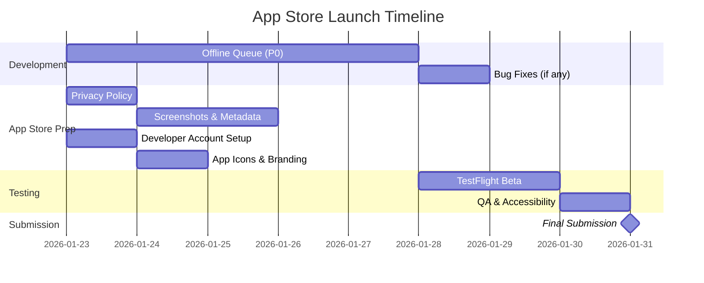

# App Store Readiness Plan
**Date**: 2026-01-22
**Status**: Pre-Launch Assessment
**Target**: First App Store Submission

---

## Executive Summary

WavelengthWatch is **functionally complete** for initial App Store launch. Core features are working well on Apple Watch Series 9 hardware:

✅ **Journal Entry Flow** - Users can log emotions and self-care strategies
✅ **Analytics** - All 5 analytics sections working (Overview, Emotional Landscape, Self-Care, Temporal Patterns, Growth Indicators)
✅ **Privacy-First Architecture** - Local SQLite storage with opt-in cloud sync
✅ **Offline-First** - App works without backend connection
✅ **Performance** - Backend analytics exceed spec by 100x (19.3ms vs 2000ms target)

**Remaining Work**: 2 critical categories
1. **Offline Queue** - Handle journal submissions when offline/backend down
2. **App Store Submission** - Metadata, screenshots, policies, compliance

---

## Phase 1: Critical for Launch (P0)

### 1.1 Offline Journal Queue (Epic #186)

**Why Critical**: Users will lose data if they log entries while offline or when backend is down. This is unacceptable for a journal app.

**Status**: 1 of 7 issues complete (14%)

**Remaining Work**:

| Issue | Title | Estimated Effort | Priority |
|-------|-------|------------------|----------|
| #189 | Implement JournalQueue service | 1 day | P0 |
| #213 | Add idempotency to backend endpoint | 0.5 day | P0 |
| #214 | Implement JournalSyncService | 1 day | P0 |
| #215 | Integrate queue into JournalClient | 0.5 day | P0 |
| #216 | UI for queue status/feedback | 1 day | P0 |
| #218 | Comprehensive offline testing | 1 day | P0 |

**Total Estimated Time**: 5 days

**Dependencies**:
- ✅ #201 (NetworkMonitor) complete
- Backend needs idempotency support
- Frontend needs queue UI

**Acceptance Criteria**:
- Users can journal while offline
- Entries automatically sync when online
- No duplicate submissions
- Clear UI feedback ("Saved locally" vs "Synced")
- Queue persists across app restarts

---

### 1.2 App Store Submission Requirements

**Why Critical**: Required by Apple for App Store listing.

**Status**: Not started

**Remaining Work**:

#### A. App Store Metadata
- [ ] **App Name**: "WavelengthWatch" (verify availability)
- [ ] **Subtitle**: Short tagline (30 chars max)
- [ ] **Description**: Full app description (4000 chars max)
- [ ] **Keywords**: Search keywords for App Store
- [ ] **Category**: Health & Fitness or Lifestyle
- [ ] **Age Rating**: Determine appropriate rating
- [ ] **Support URL**: Create support website or email
- [ ] **Marketing URL**: Optional landing page

**Estimated Time**: 1 day

#### B. Screenshots & App Preview
- [ ] **Apple Watch Screenshots** (Required):
  - 3-10 screenshots showing key features
  - Sizes: 368x448 (40mm), 396x484 (44mm), 410x502 (45mm)
  - Capture: Journal flow, Analytics, Settings
- [ ] **App Preview Video** (Optional but recommended):
  - 15-30 second video showing app in action
  - Shows value proposition clearly

**Estimated Time**: 1 day

#### C. Privacy Policy
- [ ] **Privacy Policy URL** (Required):
  - Document what data is collected
  - Explain analytics data (local vs cloud)
  - Clarify opt-in cloud sync
  - GDPR compliance statements
  - Data retention policies
- [ ] **App Privacy Details** in App Store Connect:
  - Health & Fitness data collected
  - User identifiers (if any)
  - Analytics data
  - Optional cloud sync disclosure

**Estimated Time**: 0.5 day (can use template)

#### D. Developer Account & Agreements
- [ ] **Apple Developer Account** ($99/year)
- [ ] **Paid Apps Agreement** (if monetizing)
- [ ] **Banking/Tax Information** (if monetizing)
- [ ] **App Store Guidelines Review**:
  - 4.5.1 - No data collection without consent ✅
  - 2.5.1 - App must work without backend ✅
  - 5.1.2 - Health data handling (verify compliance)

**Estimated Time**: 1 day (paperwork/setup)

#### E. App Icons & Branding
- [ ] **watchOS App Icon** (Required):
  - Multiple sizes (various @2x/@3x variants)
  - 1024x1024 for App Store
- [ ] **Companion iOS App** (if needed):
  - watchOS apps can be standalone or require iPhone
  - Verify if companion app needed for settings

**Estimated Time**: 0.5 day

#### F. Testing & QA
- [ ] **TestFlight Beta** (Recommended):
  - Invite beta testers
  - Collect feedback
  - Fix critical bugs
- [ ] **Device Testing**:
  - ✅ Apple Watch Series 9 tested
  - Test on other models if available
- [ ] **Accessibility Testing**:
  - VoiceOver support
  - Dynamic Type support
  - Color contrast verification

**Estimated Time**: 2 days (including beta feedback cycle)

**Total App Store Prep Time**: ~6 days

---

### 1.3 Critical Bug Fixes (If Any)

**Status**: No critical bugs reported from device testing

**User Feedback**:
- ✅ Privacy-first / cloud storage selection looks great
- ✅ Analytics are intriguing
- ✅ No bugs found in initial testing

**Action**: Monitor for bugs during offline queue implementation and beta testing.

---

## Phase 2: Important But Deferrable (P1)

### 2.1 Device Profiling & Optimization

| Issue | Title | Status | Can Defer? |
|-------|-------|--------|------------|
| #258 | Profile on real device | Open | Yes - optimize post-launch |
| #259 | Optimize SQLite queries | Open | Yes - backend is already 100x faster |

**Rationale for Deferring**:
- Backend performance exceeds spec by 100x
- App runs well on Series 9 (user confirmed)
- Optimization can be data-driven post-launch based on real usage

**Post-Launch Priority**: Monitor analytics performance with real users, optimize if issues arise.

---

### 2.2 Drill-Down Navigation

| Issue | Title | Status | Can Defer? |
|-------|-------|--------|------------|
| #260 | Drill-down from analytics to entries | Open | Yes - marked as future enhancement |

**Rationale for Deferring**:
- Spec lists as "Future Enhancements" (not MVP)
- Core analytics work without it
- Can add based on user feedback

**Post-Launch Priority**: Collect user feedback to validate demand.

---

### 2.3 Developer Tooling

| Issue | Title | Status | Can Defer? |
|-------|-------|--------|------------|
| #232 | Multi-PR status check script | Open | Yes - internal tooling only |

**Rationale for Deferring**:
- No user impact
- Development efficiency enhancement only

**Post-Launch Priority**: Low - implement if development pace increases.

---

## Phase 3: Future Enhancements (P2)

### 3.1 Data Persistence & Transfer (Epic #244)

**Status**: Not started
**Can Defer?**: **Yes** - Not critical for v1.0

**Included Features**:
- Export journal data to JSON/CSV
- Import from backup
- iCloud sync (optional)
- Watch-to-watch transfer
- Backend cloud sync

**Rationale for Deferring**:
- Data already persists locally in SQLite
- Opt-in cloud sync already functional
- Transfer features are "nice-to-have" for v1.0
- Can add based on user requests

**Post-Launch Priority**: Medium - plan for v1.1 or v1.2 based on user feedback.

---

## Critical Path to App Store

**Estimated Timeline**: 7-10 days from today

**Breakdown**:
- **Days 1-5**: Implement offline queue (#189, #213, #214, #215, #216, #218)
- **Days 1-4**: App Store prep (parallel with development)
- **Days 6-8**: TestFlight beta testing
- **Days 9-10**: Final QA and submission

---

## Backlog Grooming Recommendations

### Issues to Close/Defer

**Close as "Won't Do for v1.0":**
- None - all open issues have value

**Defer to Post-Launch:**
- ✅ #258 (Device profiling) → Monitor real usage first
- ✅ #259 (SQLite optimization) → Optimize if needed based on data
- ✅ #260 (Drill-down navigation) → v1.1 based on feedback
- ✅ #232 (Multi-PR script) → Developer efficiency, not blocking
- ✅ Epic #244 (Data persistence) → v1.1 or v1.2

**Mark as v1.0 Blockers:**
- 🔴 #189 (JournalQueue)
- 🔴 #213 (Idempotency)
- 🔴 #214 (JournalSyncService)
- 🔴 #215 (Queue integration)
- 🔴 #216 (Queue UI)
- 🔴 #218 (Offline testing)

### New Issues to Create

#### Issue: App Store Metadata & Screenshots
**Title**: "Create App Store metadata, screenshots, and privacy policy"
**Epic**: App Store Launch
**Priority**: P0 (Blocker)
**Estimated**: 3-4 days

**Description**:
- Write app description, keywords, subtitle
- Capture 3-10 screenshots on Apple Watch
- Create privacy policy document
- Optional: Record app preview video
- Set up support URL

---

#### Issue: TestFlight Beta Testing
**Title**: "Conduct TestFlight beta testing with external testers"
**Epic**: App Store Launch
**Priority**: P0 (Blocker)
**Estimated**: 2-3 days

**Description**:
- Set up TestFlight
- Invite 5-10 beta testers
- Collect feedback
- Fix any critical bugs discovered
- Verify app works on multiple watch models

---

#### Issue: App Store Submission Checklist
**Title**: "Complete App Store submission requirements and submit"
**Epic**: App Store Launch
**Priority**: P0 (Blocker)
**Estimated**: 1 day

**Description**:
- Verify all metadata complete
- Upload screenshots
- Submit privacy policy
- Complete developer agreements
- Submit app for review
- Monitor review status

---

## Risk Assessment

### High Risk Items

**1. App Store Review Rejection**
- **Probability**: Medium (30%)
- **Impact**: High (1-2 week delay)
- **Mitigation**:
  - Review Apple guidelines thoroughly
  - Ensure privacy policy is comprehensive
  - Test on multiple devices
  - Have clear value proposition

**2. Critical Bug in Offline Queue**
- **Probability**: Low (20%)
- **Impact**: High (blocks launch)
- **Mitigation**:
  - Comprehensive testing (#218)
  - Edge case coverage
  - Beta testing with real users

**3. Performance Issues on Older Watches**
- **Probability**: Low (15%)
- **Impact**: Medium (some users affected)
- **Mitigation**:
  - Performance already excellent (100x spec)
  - Test on multiple models if possible
  - Monitor post-launch metrics

### Low Risk Items

**4. Privacy Policy Compliance**
- **Probability**: Low (10%)
- **Impact**: Medium (requires revision)
- **Mitigation**: Use standard templates, GDPR consultant if needed

---

## Success Metrics for v1.0 Launch

**Pre-Launch (Completed ✅)**:
- ✅ All core features working on device
- ✅ Analytics functional and performant
- ✅ Privacy-first architecture implemented
- ✅ No critical bugs in device testing

**Launch Readiness (In Progress)**:
- [ ] Offline queue implemented and tested
- [ ] App Store metadata complete
- [ ] Privacy policy published
- [ ] TestFlight beta successful (no critical bugs)
- [ ] App submitted to App Store

**Post-Launch (Monitor)**:
- Downloads in first week
- User retention after 7 days
- Crash-free rate (target: >99%)
- User reviews and ratings
- Support requests (identify common issues)

---

## Recommended Next Steps

### Immediate (This Week)

1. **Start Offline Queue Implementation** (#189)
   - Begin with JournalQueue service
   - Parallel: Backend idempotency (#213)

2. **Draft Privacy Policy**
   - Use template
   - Review with legal if available
   - Publish to website or create simple hosted version

3. **Capture Screenshots**
   - On Apple Watch Series 9
   - Show key features:
     - Journal entry flow
     - Analytics overview
     - Detailed analytics
     - Settings (privacy toggle)

### Next Week

4. **Complete Offline Queue** (#214, #215, #216)
5. **TestFlight Setup & Beta Invites**
6. **Finish App Store Metadata**

### Week 3

7. **Beta Testing & Feedback**
8. **Final QA**
9. **Submit to App Store**

---

## Open Questions

1. **Monetization Strategy**:
   - Free app?
   - Paid app ($2.99-$4.99)?
   - Freemium (free + optional cloud sync upgrade)?
   - **Recommendation**: Free for v1.0, evaluate monetization based on adoption

2. **Support Channel**:
   - Email only?
   - GitHub Issues (public)?
   - Dedicated support site?
   - **Recommendation**: Start with email, add FAQ page

3. **Marketing Plan**:
   - Product Hunt launch?
   - Social media?
   - Press outreach?
   - **Recommendation**: Defer to post-launch, focus on quality first

4. **Companion iOS App**:
   - watchOS standalone?
   - Optional iPhone companion for settings?
   - **Recommendation**: watchOS standalone for v1.0 (simpler)

5. **Beta Test Scope**:
   - Internal only (friends/family)?
   - Public TestFlight?
   - **Recommendation**: 5-10 trusted testers initially

---

## Dependencies on External Factors

1. **Apple Developer Account**:
   - Requires $99/year payment
   - Processing time: 24-48 hours
   - **Action**: Set up ASAP if not done

2. **Privacy Policy Hosting**:
   - Need URL for App Store Connect
   - Options: GitHub Pages, Simple hosted page, Own domain
   - **Action**: Decide and implement

3. **Apple Review Time**:
   - Typical: 24-48 hours for initial review
   - Can be longer for first-time developers
   - **Buffer**: Plan for 3-5 days

---

## Conclusion

**WavelengthWatch is 90% ready for App Store launch.**

**Critical remaining work**:
1. Offline journal queue (5 days development)
2. App Store submission materials (4 days preparation)
3. Beta testing (2-3 days)

**Timeline**: Ready for submission in **7-10 days** with focused effort.

**Recommendation**: Start with offline queue implementation immediately (highest user impact), prepare App Store materials in parallel, then move to TestFlight beta before final submission.

---

**Next Action**: Begin implementation of Issue #189 (JournalQueue service).
